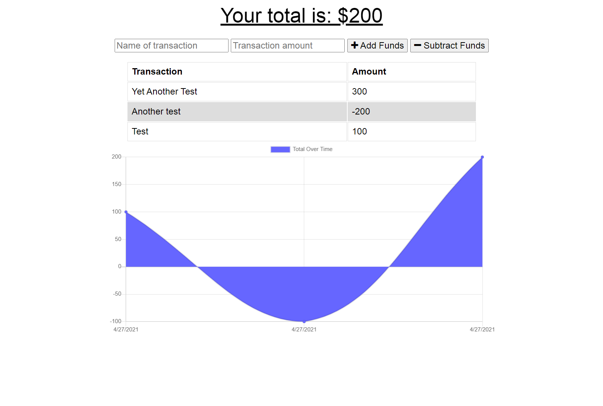

## Online/Offline Budget Tracker

## Table of Contents
1. [The Assignment](#the-assignment)
2. [Demonstration](#demonstration)
3. [Usage](#usage)
4. [Credits](#credits)
5. [Questions](#questions)

## The Assignment
Modify existing budget tracking application so that it functions offline. When the user reconnects to the network after adding transactions offline, their data should populate correctly in the chart.

## Demonstration

## Usage

Simply follow this link to use the application.

https://frozen-brook-44709.herokuapp.com/

## Credits

I was helped in this assignment by my TA Ryan Skog in our tutoring session.

## Questions

For any questions or comments, here is my contact information.
 
GitHub: https://github.com/dorrianweber
 
Email address: dorrianweber@gmail.com
